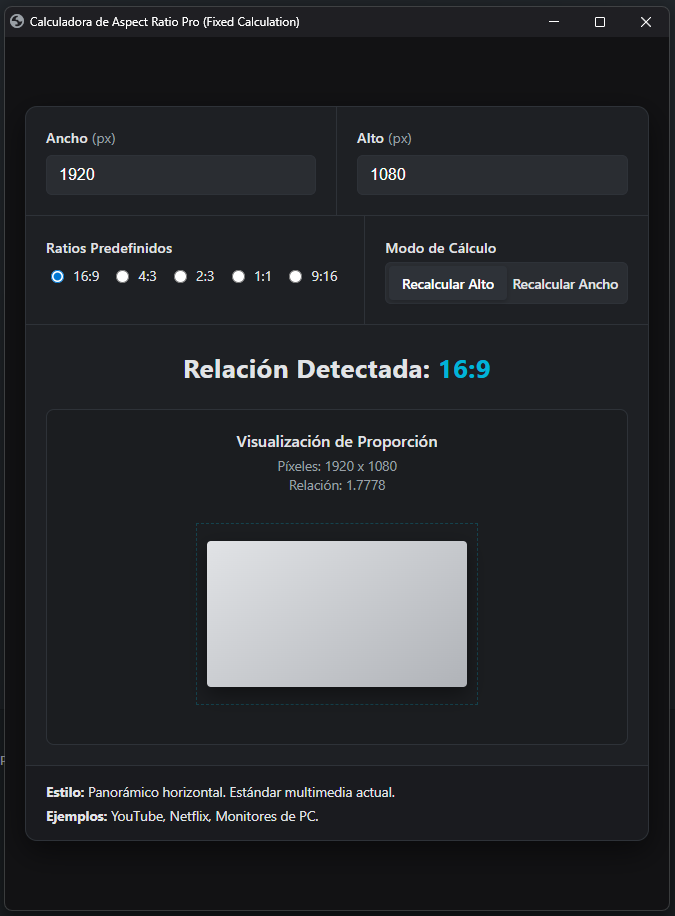

# Calculadora de Aspect Ratio Pro

Calculadora profesional para calcular y visualizar el aspect ratio de videos e imágenes.

## Características

- **Cálculo de Dimensiones**: Campos de entrada para Ancho (px) y Alto (px)
- **Ratios Predefinidos**: Opciones rápidas para ratios comunes:
  - 16:9 (Panorámico horizontal)
  - 4:3 (Estándar tradicional)
  - 2:3 (Vertical)
  - 1:1 (Cuadrado)
  - 9:16 (Vertical móvil)
- **Modos de Cálculo**:
  - Recalcular Alto: Ajusta la altura manteniendo el ancho
  - Recalcular Ancho: Ajusta el ancho manteniendo la altura
- **Detección Automática**: Identifica el ratio actual basado en las dimensiones ingresadas
- **Visualización Gráfica**: Representación visual del aspect ratio
- **Información Detallada**: Muestra:
  - Píxeles totales (ej: 1920 x 1080)
  - Relación numérica (ej: 1.7778)
  - Descripción del estilo
  - Ejemplos de uso común

## Ejemplos de Uso

- **16:9**: YouTube, Netflix, Monitores de PC - Estándar multimedia actual
- **4:3**: TV tradicional, fotografía antigua
- **1:1**: Instagram, redes sociales
- **9:16**: Stories, contenido vertical móvil

## Cómo Usar

1. Ingresa el ancho y alto en píxeles
2. Selecciona un ratio predefinido o deja que el sistema lo detecte
3. Elige el modo de cálculo (recalcular alto o ancho)
4. Visualiza el resultado y la descripción del aspect ratio
